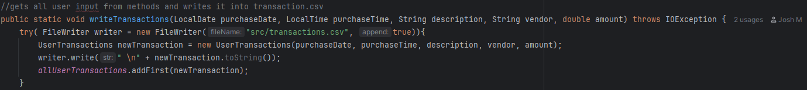

# LedgerXProject

A console-based Java app that lets users log deposits and payments, view their full transaction history, and filter through detailed reports.

---

## ⚙️ Features

- ✅ Add deposits and payments
- 🔍 Filter transactions by type or vendor
- 🧾 View reports:
    - Month to Date
    - Previous Month
    - Year to Date
    - Previous Year
- 📁 Transactions saved to CSV
- 📌 Clean terminal menu navigation

---

📸 Screenshots

  
  

---

🧠 How It Works

- The app uses a `.csv` file to store transactions
- Every deposit or payment writes a new line to the file
- `LocalDate` and `LocalTime` track when the action happened
- A list keeps all transactions in memory for filtering/report features

---

⚙️ Tech used

- Java 17+
- IntelliJ IDEA
- CSV file handling (`FileWriter`, `BufferedReader`)
- LocalDate & LocalTime for timestamps

---

## Most interesting code piece "writeTransactions();"
One of my favorite parts of this project was how I 
kept my transactions organized from newest to oldest. Instead of sorting later, 
I handled it as I added data.

📸 Screenshot of writeTransactions();

#### What it does:

- it writes a transaction to the CSV file so it’s saved permanently.
- Then, it uses addFirst() to place that transaction at the top of the list.
  That way, when I later display transactions using a for loop, they naturally print from newest to oldest, just like the project asked no reversing needed later.

#### Why I like it:
It made the logic clean, simple, and efficient. One small method handled everything in order, and it saved me from having to mess with sorting during output.

---

##  Example CSV Format

- 04-30-2025|02:36 PM|Paycheck|Acme Corp| 1500.00
- 04-30-2025|02:42 PM|Cash|Ken| 342.00

---

📸 Screenshot of Main Menu code and its output in terminal 

~Scroll down to see more~

---

## 👤 Author

**Joshua Manzano**  
Year Up Software Development Program  
Capstone Project – 2025 